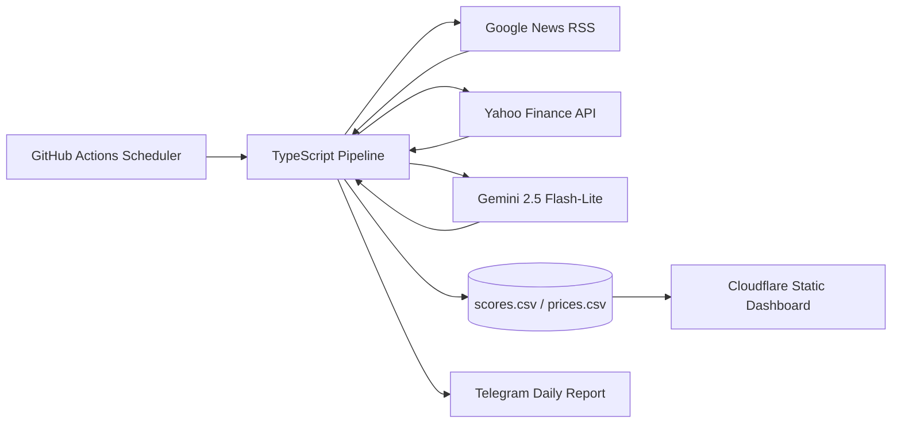

# Morning Report Alpha

> **외부 데이터 수집 → AI 분석 → 저장 → 대시보드 → 알림**을 하나의 운영 가능한 워크플로로 연결한 개인 프로젝트입니다.

[라이브 대시보드](https://investing.twojh.com/) · [프로젝트 소스](https://github.com/dev-jhjoo/morning-report-alpha)

한국·미국 주요 20개 종목의 최근 뉴스와 가격 데이터를 수집하고, Gemini로 투자심리 데이터를 정형화해 대시보드와 Telegram 리포트로 제공합니다. 사람이 매일 반복하던 정보 탐색·정리 과정을 자동화하되, 외부 API의 실패와 속도 제한도 함께 다루는 것을 목표로 했습니다.

> 이 프로젝트의 분석 결과는 뉴스 헤드라인을 기반으로 생성되는 참고용 정보이며, 투자 조언 또는 수익 보장을 의미하지 않습니다.

---

## Why I built this

매일 여러 종목의 뉴스를 확인하고 가격을 비교하는 흐름에는 세 가지 문제가 있었습니다.

1. 뉴스·가격·해석이 여러 서비스에 흩어져 있어 반복 확인 비용이 큼
2. AI 결과가 자유 텍스트이면 대시보드나 알림에 안정적으로 재사용하기 어려움
3. 정기 실행과 외부 API 장애 대응이 없으면 개인 스크립트에 머무름

그래서 데이터 수집부터 분석·저장·전달까지를 자동화하고, 사람이 바로 볼 수 있는 형태로 제공하는 작은 **AI workflow / internal-tool style pipeline**을 만들었습니다.

## What it does

- **뉴스 수집**: Google News RSS에서 종목별 최근 24시간 뉴스 헤드라인 수집
- **가격 수집**: Yahoo Finance 데이터로 일일 종가 및 장중 시세 갱신
- **AI 분석**: Gemini 2.5 Flash-Lite Structured Output으로 결과를 JSON Schema에 맞춰 생성
- **데이터 누적**: 투자심리와 가격을 CSV/JSON으로 저장해 이력 조회 가능
- **대시보드 제공**: Cloudflare에 배포된 정적 대시보드에서 종목·시장별 조회 및 차트 제공
- **알림 전달**: Telegram 리포트로 당일 핵심 결과 전송
- **운영 자동화**: GitHub Actions가 평일 아침 리포트와 장중 시세 갱신 실행

## Architecture



### Daily report flow

```text
1. 종목별 최근 24시간 뉴스 수집
2. Gemini Structured Output으로 score / trend / summary / insight 생성
3. 일일 종가 수집 및 CSV 누적
4. Telegram 리포트 생성·분할 발송
5. GitHub Actions가 변경된 data/ 파일을 커밋
6. Cloudflare 대시보드에서 누적 데이터를 조회
```

## Data contract

AI 응답은 자유 형식 텍스트 대신 아래 구조로 강제합니다. 이렇게 하면 결과를 CSV, 대시보드, Telegram 메시지에 일관되게 연결할 수 있습니다.

```json
{
  "score": 0,
  "trend": "관망",
  "summary": [
    "핵심 팩트 1",
    "핵심 팩트 2",
    "핵심 팩트 3"
  ],
  "insight": "한 줄 인사이트"
}
```

| Field | Description |
| --- | --- |
| `score` | 0~100 범위의 뉴스 기반 투자심리 점수 |
| `trend` | 강한 매수 / 분할 매수 / 관망 / 비중 축소 / 적극 매도 |
| `summary` | 노이즈를 제외한 핵심 뉴스 팩트 3개 |
| `insight` | 당일 관찰 포인트를 담은 한 줄 인사이트 |

## Reliability decisions

개인 프로젝트라도 외부 의존성이 많기 때문에, 단순 성공 경로 외의 운영 조건을 함께 구현했습니다.

- **Rate limit 대응**: Gemini `429` / `503` 오류는 최대 3회 재시도
- **서버 지시 우선**: `RetryInfo.retryDelay`가 있으면 우선 적용하고, 없으면 3초 대기. 대기는 최대 60초로 제한
- **요청 간격 제어**: 종목별 분석 요청 사이 2초 대기
- **정형 응답 보장**: Gemini `responseMimeType: application/json`과 JSON Schema 사용
- **알림 데이터 손실 방지**: Telegram 4096자 제한보다 작은 3900자 단위로 줄 경계 분할
- **실패 감지**: Telegram API가 HTTP 200이더라도 `ok: false` 응답을 별도 검증
- **분석 실패와 가격 수집 분리**: AI 분석이 실패해도 가격 시계열은 계속 누적 시도

## Automation

### Morning report

GitHub Actions가 평일 UTC 22:00에 실행됩니다. 이는 한국 시간 기준 **평일 오전 7:00**입니다.

```text
뉴스 수집 → AI 분석 → 종가 수집 → CSV 저장 → Telegram 발송 → data/ 커밋
```

## Tech stack

| Area | Technologies |
| --- | --- |
| Runtime | Node.js, TypeScript, ESM, `tsx` |
| Data sources | Google News RSS, Yahoo Finance API |
| AI | Gemini 2.5 Flash-Lite, Structured Output / JSON Schema |
| Scheduling | GitHub Actions |
| Storage | CSV, JSON tracked in Git |
| Delivery | Telegram Bot API |
| Dashboard | HTML / JavaScript, Cloudflare |

## Repository structure

```text
.
├── .github/workflows/
│   └── cron-action.yml      # 평일 아침 AI 리포트 생성
├── data/
│   ├── scores.csv           # 일별 투자심리 결과
│   └── prices.csv           # 일별 종가 이력
├── src/
│   ├── main.ts              # 파이프라인 오케스트레이션 + Telegram 발송
│   ├── scraper.ts           # Google News RSS 수집
│   ├── analyzer.ts          # Gemini Structured Output 분석 + 재시도
│   ├── price.ts             # 일일 종가 수집
│   └── storage.ts           # CSV 누적 저장
└── index.html               # 정적 대시보드
```

## Run locally

### Prerequisites

- Node.js 20+
- Gemini API key
- Telegram Bot token / chat ID (알림을 사용할 경우)

### Install

```bash
npm ci
```

### Environment variables

```env
GEMINI_API_KEY=your_gemini_api_key
TELEGRAM_BOT_TOKEN=your_bot_token
TELEGRAM_CHAT_ID=your_chat_id
```

### Run the full pipeline

```bash
npm run start
```

실행 시 뉴스 수집 → AI 분석 → 가격 수집 → 데이터 저장 → Telegram 발송 순으로 진행됩니다.

### 특정 종목/시장만 실행 (백필·디버그)

환경 변수로 대상을 좁힐 수 있습니다. 미지정이면 전체.

```bash
MARKET=US TICKER=NVIDIA npm start        # NVIDIA만
TICKER="NVIDIA,Apple" npm start          # 여러 종목
```

- `MARKET=KR|US` — 심볼 접미사(.KS=한국)로 시장 필터
- `TICKER=이름[,이름...]` — TARGET_TICKERS의 종목명으로 필터

주의: 뉴스(`when:1d`)·가격(Yahoo)은 항상 **실행 시점의 최신 데이터**라 과거 날짜 데이터를 소급 수집할 수는 없습니다. 백필은 "누락된 종목을 지금 채우는" 용도.

## Scope and next steps

현재 프로젝트는 **뉴스 헤드라인 기반의 정보 정리·관찰 도구**입니다. 분석 품질 평가, 모델 비용 모니터링, 프롬프트 버전 관리, 점수 변화 기반 알림 규칙은 다음 단계로 확장할 수 있습니다.

- [ ] 점수 급등·급락 기준의 이벤트 알림
- [ ] 날짜 범위와 이동평균을 포함한 히스토리 차트 개선
- [ ] 프롬프트·모델별 결과와 비용 추적
- [ ] 뉴스 소스·종목별 분석 품질 평가 지표 추가
- [ ] 읽기 전용 MCP 도구로 투자심리·가격 이력 제공

## Portfolio takeaway

이 저장소는 LLM API를 한 번 호출하는 예제가 아니라, **외부 데이터·정형 AI 출력·스케줄링·저장·대시보드·알림을 실제로 이어 붙이고 실패 조건까지 다룬 작은 운영 시스템**입니다.
